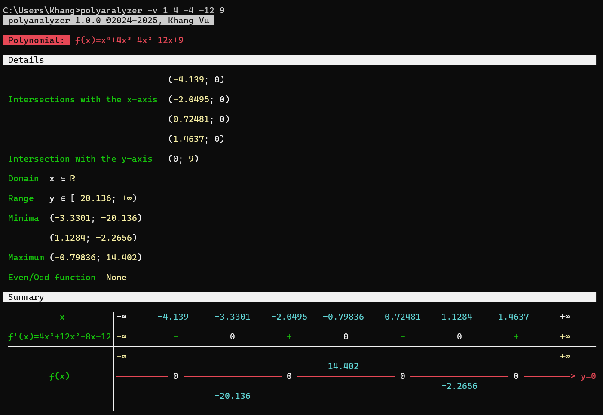

# Polynomial Analyzer 

A Windows console application that analyzes **_linear_**, **_quadratic_**, **_cubic_**, and **_quartic_** functions. This program generates the **_variation table_** of the function and can provide detailed **_mathematical insights_**.

## Features

-   Analyze functions of degree 1 to 4 (**_linear_** to **_quartic_**).
-   Display the **_variation table_** of the function.
-   With the verbose (`-v`) switch, calculate and display:
    
    1.  **_x-intercepts_**
    2.  **_y-intercept_**
    3.  **_Domain_**
    4.  **_Range_**
    5.  **_Extrema_** (Minima & Maxima)
    6.  **_Symmetry_** (Even, Odd, or neither)

-   Simple, fast, and lightweight **_console-based_** interface.

## Usage

```cmd
Usage: polyanalyzer [--help] [-hv] [a] [b] [c] [d] [e]
switches:
        h       help
        v       verbose
arguments:
        a       coefficient of x⁴
        b       coefficient of x³
        c       coefficient of x²
        d       coefficient of x
        e       independent coefficient
```

## Demonstration

### Default Behavior


### With the Verbose (`-v`) Switch:

